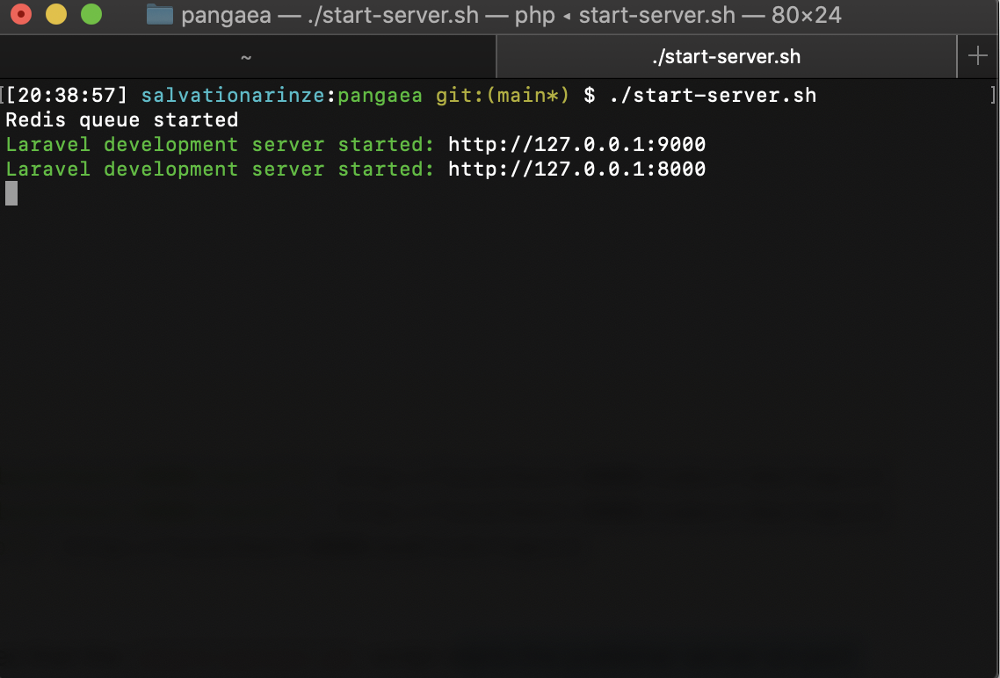
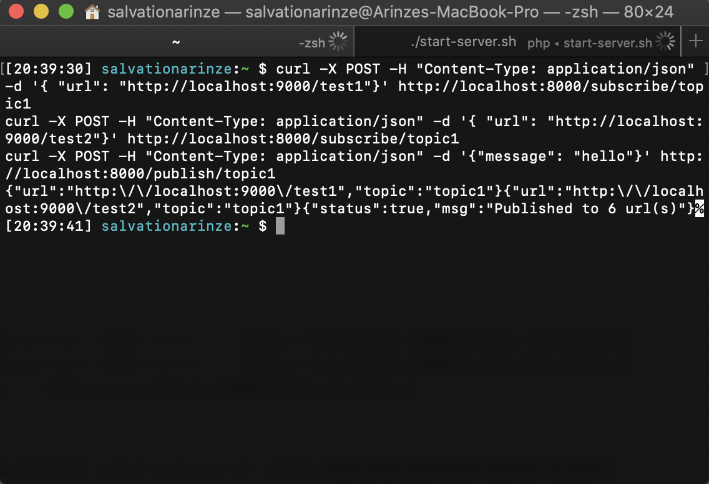
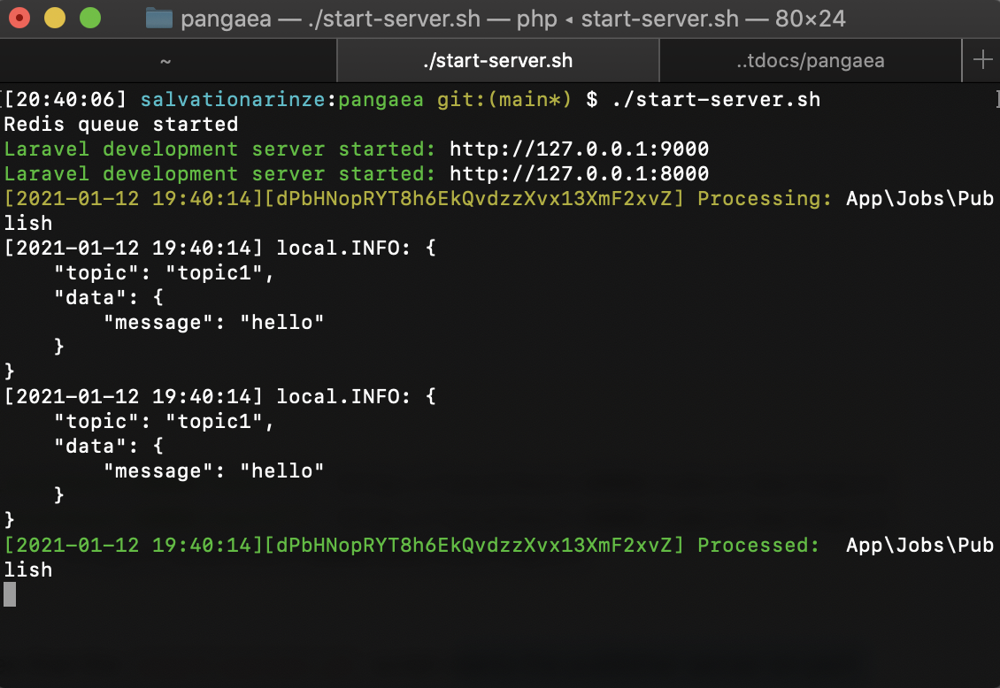

# HTTP Notification System
 A redis server keeps track of topics -> subscribers where a topic is a string and a subscriber is an HTTP endpoint.  When a message is published on a topic, it should be forwarded to all subscriber endpoints. This system simulates redis pub/sub infrastructure.


### System requirements ###

1. PHP 7.2.0 or greater
2. Redis 6.0 or greater

## Getting Started ##

* Open terminal
* Start redis queue, publisher and subscriber server.
```
./start-server.sh"
```
This will start up redis queue for batch processing and also starts the publisher server on port 8000 and another server is running on port 9000 (subscriber).



* Open a new terminal to simulate the subscriber and publisher events
```
curl -X POST -H "Content-Type: application/json" -d '{ "url": "http://localhost:9000/test1"}' http://localhost:8000/subscribe/topic1
curl -X POST -H "Content-Type: application/json" -d '{ "url": "http://localhost:9000/test2"}' http://localhost:8000/subscribe/topic1
curl -X POST -H "Content-Type: application/json" -d '{"message": "hello"}' http://localhost:8000/publish/topic1
```



* Output 

The subscriber will be getting data forwarded to it when its corresponding topic is published, which it will then receive and print the data to verify everything is working at the test1 and test2 endpoints.


